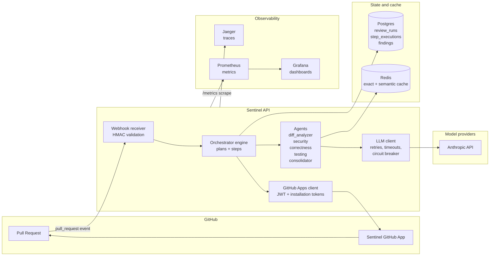

# Sentinel Architecture

> Status: Week 1 draft. Updated weekly; final version lands Week 8.

## What this document covers

This is the system-level view: components, data flow, tech-stack rationale. For *why* certain non-obvious decisions were made, see [design-decisions.md](design-decisions.md) (authored from Week 2 onward). For operating procedures, see [runbook.md](runbook.md). For the project's overall philosophy and operating rules, see [CLAUDE.md](../CLAUDE.md).

## System overview

## Components

### Webhook receiver (`apps/api/routes/webhooks.py`)

Public entry point. Three responsibilities:

1. **Authenticate the sender.** GitHub signs every delivery with HMAC-SHA256 over the raw body using the App's webhook secret. Without this check, anyone can POST fake events. Validation lives in `packages/core/github/signature.py` and uses `hmac.compare_digest` for constant-time comparison.
2. **Acknowledge fast.** GitHub gives webhook receivers ~10 seconds before considering the delivery failed. The receiver creates the `ReviewRun` row, schedules orchestration as background work, and returns 202 immediately.
3. **Filter events.** Only `pull_request.{opened,synchronize,reopened}` triggers a review. Other events are recorded and ignored.

### Orchestrator (`packages/core/orchestrator/`, Week 2)

Deterministic state machine that walks a `Plan` (an ordered list of `Step`s). For each step it: snapshots inputs to Postgres, runs the step under a timeout, snapshots outputs, emits a span, emits metrics. **This is the differentiator.** The LLM never decides what step runs next; it returns typed data that the orchestrator reads.

### Agents (`packages/core/agents/`, Weeks 3-4)

Each agent is a `Step` whose execution wraps an LLM call. Inputs and outputs are Pydantic models. Structured outputs are enforced via Anthropic tool use, with retry-on-validation-failure (the validation error is fed back into the next prompt). Agents are pure functions of their inputs in the sense that re-running with the same inputs and the same prompt version produces equivalent output (modulo model nondeterminism, which is bounded).

The Week 4 lineup:
- `diff_analyzer` — categorises the diff, surfaces risk hints.
- `security_reviewer`, `correctness_reviewer`, `testing_reviewer` — three specialists running in parallel.
- `consolidator` — pure Python, no LLM. Dedupes, ranks, applies repo policy thresholds.

### LLM client (`packages/core/llm/`, Week 3)

Thin async wrapper around the Anthropic SDK with timeouts, retries (exponential backoff + jitter), token counting, cost calculation, OTel spans per call, and per-provider circuit breaker (Week 6). No LangChain. The wrapper is the place where reliability and cost controls live so individual agents stay simple.

### GitHub client (`packages/core/github/`)

Authenticates as a GitHub App: signs a short-lived JWT with the App's private key, exchanges it for an installation access token, caches the token until expiry. Exposes the surface the orchestrator needs: fetch unified diff, fetch surrounding file context, post issue comment, post inline review comments, post commit status.

### Persistence

- **Postgres 16** holds `review_runs`, `step_executions` (with `inputs`/`outputs` JSONB for replay), and from Week 4 `review_findings`.
- **Redis 7** holds caches (exact-match keyed on `hash(diff + model + agent + prompt_version)`, optional semantic cache for low-stakes outputs only) and operational state (rate-limit counters, budget consumption).

### Observability

- **OpenTelemetry** for traces. The FastAPI app, the httpx client, and SQLAlchemy are all instrumented. Custom spans wrap each step and each LLM call. `run_id` and `pr_url` propagate as OTel baggage so every child span carries them.
- **Prometheus** for metrics. A single registry in `packages/core/observability/metrics.py` defines named, labeled counters and histograms. The API exposes `/metrics`.
- **Grafana** dashboards live as committed JSON in `infra/grafana/`. Week 6 fills out system, cost, quality, and reliability boards.
- **structlog** emits JSON in production and pretty-prints in development. `request_id` is bound to every log line via contextvars.

## Data flow: one PR end-to-end

1. Developer opens or pushes to a PR. GitHub fires a `pull_request.opened` (or `synchronize`) webhook.
2. The webhook receiver validates the HMAC signature, parses the payload, and inserts a `ReviewRun` row with `status="pending"`. A `request_id` is bound to logs and OTel baggage at this point.
3. The orchestrator picks up the run and walks `default_review_plan`:
   - `fetch_diff` calls the GitHub API to get the unified diff plus surrounding context.
   - `analyze_diff` (LLM) returns a typed `DiffAnalysis`.
   - `security_review`, `correctness_review`, `testing_review` run in parallel, each returning `list[ReviewFinding]`.
   - `consolidate` (pure Python) dedupes, applies `.sentinel.yml` thresholds, ranks.
   - `post_comments` writes inline review comments and a summary comment.
4. Every step writes its `inputs` and `outputs` JSONB to `step_executions`. Every external call (LLM, GitHub, DB) is its own OTel span. Every step increments Prometheus counters and observes a duration histogram.
5. The `ReviewRun` row is updated to `status="completed"` with total cost and token counts. The full trace is queryable in Jaeger by `request_id`.

Week 1's pipeline stops at step 2 plus a placeholder comment. Step 3 onwards is built incrementally in Weeks 2-4.

## Tech stack rationale

| Choice | Why |
| --- | --- |
| Python 3.12 | Async maturity, strong typing, the language Anthropic's SDK is most idiomatic in. |
| FastAPI + Pydantic v2 | Async-first, schema-enforced I/O at boundaries, automatic OpenAPI. |
| SQLAlchemy 2.0 async + Alembic | Schema control with migrations, JSONB support, mature async ergonomics. |
| Postgres 16 | JSONB columns are load-bearing for the replay model. Mature, boring, free. |
| Redis 7 | Caching and rate-limit state; one tool, many uses. |
| Anthropic SDK directly | Frameworks like LangChain hide what matters. Tool use for structured outputs is a thin primitive that does not need wrapping. |
| Docker + docker-compose locally; k8s manifests for show | The cheap deploy target is one VPS. The k8s manifests demonstrate capability without paying EKS prices. |
| OpenTelemetry + Jaeger + Prometheus + Grafana | Industry standard, vendor-neutral, what platform teams actually run. |
| structlog | JSON logs are non-negotiable for production observability. Pretty console output in dev is a quality-of-life win. |
| uv | Fast, single-binary, lockfile-driven dependency management. Replaces pip + pip-tools + venv. |

## What is out of scope (and why)

- **A frontend framework.** The Week 7 web UI uses HTMX. Building a React app is not what this project demonstrates.
- **Multi-tenant SaaS features.** Sentinel is single-tenant. Per-repo policy in `.sentinel.yml` is enough variation.
- **LLM-driven control flow.** This is the anti-pattern the whole project is structured to avoid.
- **Vector databases.** Semantic cache uses Redis with cosine similarity over small embeddings. A dedicated vector DB would be infrastructure for problems Sentinel does not have.

## What changes in later weeks

- Week 2: this doc gets the orchestrator section filled in concretely.
- Week 4: agent section becomes detailed; `.sentinel.yml` schema documented.
- Week 5: eval methodology gets its own document.
- Week 6: reliability primitives and dashboards documented.
- Week 8: full design-decisions doc, demo video link, blog post link.
